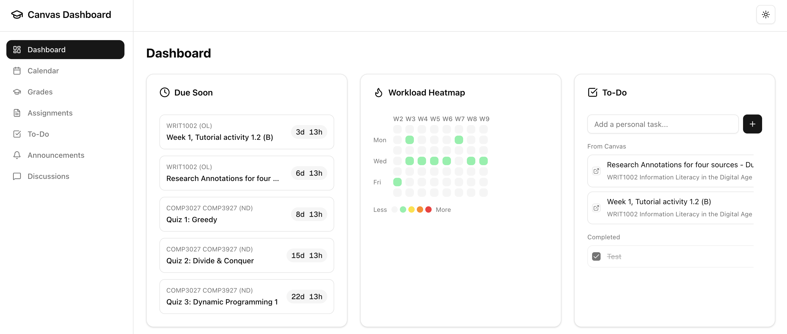

# Canvas Dashboard

A unified dashboard for Canvas LMS that brings everything a student needs into one clean interface.



## Features

- **Unified Calendar** - All assignments and events in one view
- **Grades Overview** - Current grades across all courses
- **Upcoming Assignments** - Prioritized list of what's due
- **Assignment Details** - Descriptions, files, and rubrics
- **Workload Heatmap** - Visualize busy weeks ahead with semester week labels
- **Due Date Countdowns** - Never miss a deadline
- **To-Do List** - Canvas + personal tasks (persisted to JSON)
- **Announcements Feed** - All course announcements
- **Discussion Tracker** - Stay on top of discussions
- **Dark Mode** - Easy on the eyes

## Tech Stack

- Next.js + TypeScript
- Tailwind CSS + shadcn/ui
- Canvas LMS API

## Getting Started

### Prerequisites

- Node.js 18+
- A Canvas LMS account with API access

### Setup

1. Clone the repository:
   ```bash
   git clone https://github.com/joshbermanssw/canvas-dashboard.git
   cd canvas-dashboard
   ```

2. Install dependencies:
   ```bash
   npm install
   ```

3. Create your environment file:
   ```bash
   cp .env.example .env.local
   ```

4. Get your Canvas API token:
   - Go to Canvas → Account → Settings
   - Scroll to "Approved Integrations"
   - Click "+ New Access Token"
   - Copy the token to `.env.local`

5. Run the development server:
   ```bash
   npm run dev
   ```

6. Open [http://localhost:3000](http://localhost:3000)

## Documentation

See [SPEC.md](./SPEC.md) for detailed project specification.

## License

MIT
